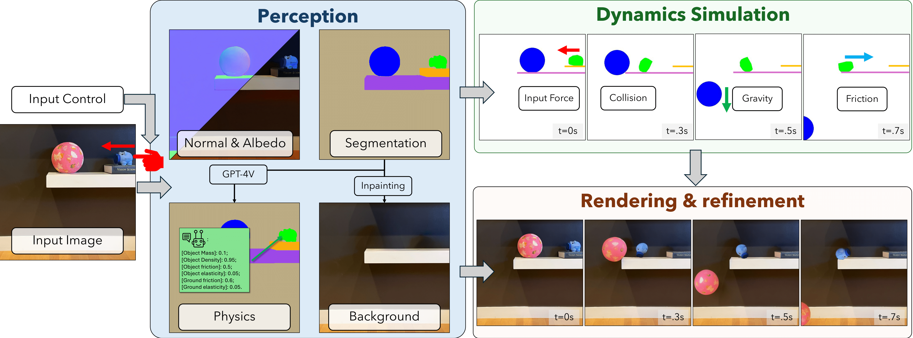

<br />
<p align="center">

  <h1 align="center">PhysGen: Rigid-Body Physics-Grounded <br>Image-to-Video Generation</h1>

  <p align="center">
   ECCV, 2024
    <br />
    <a href="https://stevenlsw.github.io"><strong>Shaowei Liu</strong></a>
    ·
    <a href="https://jason718.github.io/"><strong>Zhongzheng Ren</strong></a>
    ·
    <a href="https://saurabhg.web.illinois.edu/"><strong>Saurabh Gupta*</strong></a>
    ·
    <a href="https://shenlong.web.illinois.edu/"><strong>Shenlong Wang*</strong></a>
    ·
  </p>

<p align="center"> 

</p>

  <p align="center">
    <a href='https://shaoweiliu.web.illinois.edu/eccv2024_physgen_arxiv.pdf'>
      
    </a>
    <a href='https://stevenlsw.github.io/physgen/' style='padding-left: 0.5rem;'>
      
    <a href='https://colab.research.google.com/drive/1imGIms3Y4RRtddA6IuxZ9bkP7N2gVVC_' style='padding-left: 0.5rem;'></a>
    <a href='https://youtu.be/lCc1rHePEFQ' style='padding-left: 0.5rem;'>
      
    </a>
  </p>

</p>
<br />

This repository contains the pytorch implementation for the paper [PhysGen: Rigid-Body Physics-Grounded Image-to-Video Generation](https://stevenlsw.github.io/physgen/), ECCV 2024. In this paper, we present a novel training-free image-to-video generation pipeline integrates physical simulation and generative video diffusion prior.

## Overview


## 📄 Table of Contents

- [Installation](#installation)
- [Colab notebook](#colab-notebook)
- [Quick Demo](#quick-demo)
- [Perception](#perception)
- [Simulation](#simulation)
- [Rendering](#rendering)
- [All-in-One command](#all-in-one-command)
- [Citation](#citation)


## Installation
- Clone this repository: 
    ```Shell
    git clone --recurse-submodules https://github.com/stevenlsw/physgen.git
    cd physgen
    ```
- Install requirements by the following commands:
    ```Shell
    conda create -n physgen python=3.9
    conda activate physgen
    pip install -r requirements.txt
    ```

## Colab notebook
Run our [Colab notebook](https://colab.research.google.com/drive/1imGIms3Y4RRtddA6IuxZ9bkP7N2gVVC_) for quick start! 


## Quick Demo 

- Run image space dynamics simulation in just **3** seconds **without GPU and any displace device and additional setup** required!
    ```Shell
    export PYTHONPATH=$(pwd)
    name="pool"
    python simulation/animate.py --data_root data --save_root outputs --config data/${name}/sim.yaml 
    ```
- The output video should be saved in `outputs/${name}/composite.mp4`. Try set `name` to be `domino`, `balls`, `pig_ball` and `car` for other scenes exploration. The example outputs are shown below:

  | **Input Image** | **Simulation** | **Output Video** |
  |:---------------:|:--------------:|:----------------:|
  |  |  |  |
  |  |  |  |


## Perception
- Please see [perception/README.md](perception/README.md) for details.

| **Input** | **Segmentation** | **Normal** | **Albedo** | **Shading** | **Inpainting** |
|:---------:|:----------------:|:----------:|:----------:|:-----------:|:--------------:|
|  |  |  |  |  |  |


## Simulation
- Simulation requires the following input for each image:
  ```Shell
  image folder/ 
    ├── original.png
    ├── mask.png  # segmentation mask
    ├── inpaint.png # background inpainting
    ├── sim.yaml # simulation configuration file
  ```

- `sim.yaml` specify the physical properties of each object and initial conditions (force and speed on each object). Please see `data/pig_ball/sim.yaml` for an example. Set `display` to `true` to visualize the simulation process with display device, set `save_snapshot` to `true` to save the simulation snapshots.
- Run the simulation by the following command:
  ```Shell
  cd simulation
  python animate.py --data_root ../data --save_root ../outputs --config ../data/${name}/sim.yaml
  ```
- The outputs are saved in `outputs/${name}` as follows:
  ```Shell
  output folder/
    ├── history.pkl # simulation history
    ├── composite.mp4 # composite video
    |── composite.pt # composite video tensor
    ├── mask_video.pt # foreground masked video tensor
    ├── trans_list.pt # objects transformation list tensor
  ```

## Rendering

### Relighting
- Relighting requires the following input:
  ```Shell
  image folder/ # 
    ├── normal.npy # normal map
    ├── shading.npy # shading map by intrinsic decomposition
  previous output folder/
    ├── composite.pt # composite video
    ├── mask_video.pt # foreground masked video tensor
    ├── trans_list.pt # objects transformation list tensor

  ```
- The `perception_input` is the image folder contains the perception result. The `previous_output` is the output folder from the previous simulation step.
- Run the relighting by the following command:
  ```Shell
  cd relight
  python relight.py --perception_input ../data/${name} --previous_output ../outputs/${name} 
  ```
- The output `relight.mp4` and `relight.pt` is the relighted video and tensor. 
- Compare between composite video and relighted video:
  | **Input Image** | **Composite Video** | **Relight Video** |
  |:---------------:|:-------------------:|:-----------------:|
  |  |  |  |


### Video Diffusion Rendering
- Download the [SEINE](https://github.com/Vchitect/SEINE/) model follow [instruction](https://github.com/Vchitect/SEINE/tree/main?tab=readme-ov-file#download-our-model-and-t2i-base-model)

  ```Shell
  # install git-lfs beforehand
  mkdir -p diffusion/SEINE/pretrained
  git clone https://huggingface.co/CompVis/stable-diffusion-v1-4 diffusion/SEINE/pretrained/stable-diffusion-v1-4
  wget -P diffusion/SEINE/pretrained https://huggingface.co/Vchitect/SEINE/resolve/main/seine.pt
  ```

- The video diffusion rendering requires the following input:
  ```Shell
  image folder/ # 
    ├── original.png # input image
    ├── sim.yaml # simulation configuration file (optional)
  previous output folder/
    ├── relight.pt # composite video
    ├── mask_video.pt # foreground masked video tensor
  ```
- Run the video diffusion rendering by the following command:
  ```Shell
  cd diffusion
  python video_diffusion.py --perception_input ../data/${name} --previous_output ../outputs/${name} 
  ```
  `denoise_strength` and `prompt` could be adjusted in the above script. `denoise_strength` controls the amount of noise added, 0 means no denoising, 1 means denoise from scratch with lots of variance to the input image. `prompt` is the input prompt for video diffusion model, we use default foreground object names from perception model as prompt.


- The output `final_video.mp4` is the rendered video.

- Compare between relight video and diffuson rendered video:
  | **Input Image**                        | **Relight Video**                           | **Final Video**                             |
  |:--------------------------------------:|:--------------------------------------------:|:--------------------------------------------:|
  |  |  |  |


## All-in-One command
We integrate the simulation, relighting and video diffusion rendering in one script. Please follow the [Video Diffusion Rendering](#video-diffusion-rendering) to download the SEINE model first.
```Shell
bash scripts/run_demo.sh ${name}
```


## Citation

If you find our work useful in your research, please cite:

```BiBTeX
@inproceedings{liu2024physgen,
  title={PhysGen: Rigid-Body Physics-Grounded Image-to-Video Generation},
  author={Liu, Shaowei and Ren, Zhongzheng and Gupta, Saurabh and Wang, Shenlong},
  booktitle={European Conference on Computer Vision ECCV},
  year={2024}
}
```


## Acknowledgement
* [Grounded-Segment-Anything
](https://github.com/IDEA-Research/Grounded-Segment-Anything) for segmentation in [perception](#perception) 
* [GeoWizard
](https://github.com/fuxiao0719/GeoWizard) for depth and normal estimation in [perception](#perception) 
* [Intrinsic](https://github.com/compphoto/Intrinsic/) for intrinsic image decomposition in in [perception](#perception) 
* [Inpaint-Anything](https://github.com/geekyutao/Inpaint-Anything) for image inpainting in [perception](#perception)
* [Pymunk](https://github.com/viblo/pymunk) for physics simulation in [simulation](#simulation)
* [SEINE](https://github.com/Vchitect/SEINE/) for video diffusion in [rendering](#rendering) 